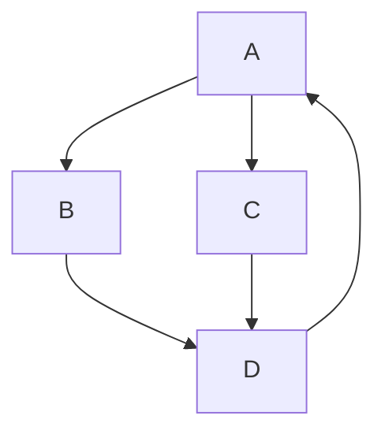

# MarkdownDemo

Det her er ens test af programmet 

## what up next
  * Det ved vi sgu ikke
    * Hej
      * hej


### What up now 

jeg fatter det ikke

```python
import this

def myfunc():
     Return 2
```

```html
<html>
<title></title>
</html>
```

# You can write formulas

Math can be included inline as in laTEX with the code
`$c=\sqrt(a^2+B^2)$`that will render to: $c=\sqrt(a^2+b^2)$.
or in hole line blocks like `$$c=\sqrt(a^2+b^2)$$´that will render to:

$$c=\sqrt(a^2+b^2)$$

Or as tagget equation:

$$c=\sqrt(a^2+b^2)\tag{1}$$




